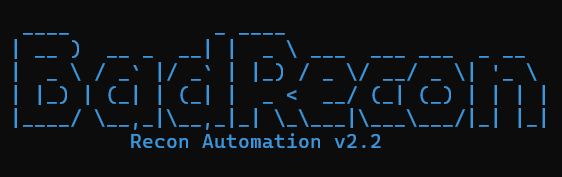

# BadRecon

**Automated subdomain & recon enumeration pipeline (Passive, Archive, Active, Live checks)**

BadRecon is a bash-based reconnaissance automation tool for bug bounty hunters and penetration testers. It runs a full subdomain enumeration pipeline — combining passive sources, archive mining, active DNS bruteforcing, TLS certificate scraping, IP pivoting, and live host detection — into one organized workflow with logging and a final summary report.

---

## Features

- **Passive Recon** — Subfinder + Assetfinder for fast API-based subdomain discovery
- **Archive Mining** — Waymore integration to pull historical URLs/subdomains from the Wayback Machine
- **Active Recon** — DNS bruteforce with Puredns, zone transfer checks, TLS/SAN certificate grabbing
- **Merging & Deduplication** — Combines all sources, removes duplicates, resolves live subdomains
- **IP Extraction** — Extracts unique IPs and PTR records for network pivoting
- **Live Host Detection** — Identifies live web servers via httpx (or a custom live-check script with screenshots)
- **Logging & Stats** — Color-coded logs, per-phase timing, and a final summary report

---

## Requirements

Make sure the following tools are installed and available in your `$PATH`:

| Tool | Purpose |
|------|---------|
| [subfinder](https://github.com/projectdiscovery/subfinder) | Passive subdomain enumeration |
| [assetfinder](https://github.com/tomnomnom/assetfinder) | Passive subdomain enumeration |
| [puredns](https://github.com/d3mondev/puredns) | DNS bruteforce & resolution |
| [dnsx](https://github.com/projectdiscovery/dnsx) | DNS resolution / IP & PTR extraction |
| [tlsx](https://github.com/projectdiscovery/tlsx) | TLS certificate subdomain extraction |
| [httpx](https://github.com/projectdiscovery/httpx) | Live host detection (fallback) |
| [waymore](https://github.com/xnl-h4ck3r/waymore) | Archive/Wayback Machine mining |
| `dig`, `python3`, `wget` | Standard system utilities |

### Optional

- A custom `thc_livecheck.py` script for live host checking with screenshots
- `subdomains-top1million-110000.txt` wordlist (place it in the script's directory for DNS bruteforcing)
- `resolvers.txt` (auto-downloaded if missing)

---

## Installation

```bash
git clone https://github.com/Yasserr257/BadRecon.git
cd BadRecon
chmod +x BadRecon.sh
```

Place the following files in the same directory as `BadRecon.sh` (optional, used if present):

- `resolvers.txt`
- `subdomains-top1million-110000.txt`
- `thc_livecheck.py`
- `waymore/waymore.py`

---

## Usage

```bash
./BadRecon.sh <domain>
```

Example:

```bash
./BadRecon.sh example.com
```

---

## Output Structure

```
example.com/
├── 01_Subdomains/
│   ├── subfinder.txt
│   ├── assetfinder.txt
│   ├── waymore_subs.txt
│   ├── puredns_brute.txt
│   └── tls_subs.txt
├── 02_DNS/
│   └── resolved_subs.txt
├── 03_Network/
│   ├── zone_transfer.txt
│   ├── public_ips.txt
│   └── ptr_records.txt
├── 04_Live/
│   ├── live_report.txt        # if custom live-check script is used
│   └── fallback_live.txt      # if httpx fallback is used
├── all_subs_raw.txt
├── badrecon.log
└── SUMMARY_REPORT.txt
```

---

## How It Works

1. **Phase 1 — Passive Enumeration**: Runs Subfinder and Assetfinder.
2. **Phase 2 — Archive Mining**: Uses Waymore to extract subdomains from historical URLs.
3. **Phase 3 — Active Recon**: DNS bruteforce (Puredns), zone transfer attempts, and TLS certificate scraping.
4. **Phase 4 — Merging & Deduplication**: Combines all sources and resolves live subdomains.
5. **Phase 5 — IP Extraction**: Extracts unique IPs and reverse DNS (PTR) records.
6. **Phase 6 — Live Check**: Identifies live web servers (via custom script or httpx fallback).

A final `SUMMARY_REPORT.txt` is generated with stats per source, aggregated totals, and execution time per phase.

---

>## Made with 🖤 by **BadYasser**

---
## Disclaimer

This tool is intended for **authorized security testing and bug bounty programs only**. Always ensure you have explicit permission to test the target domain. The author is not responsible for any misuse of this tool.

---

## License

This project is licensed under the MIT License — see [LICENSE](LICENSE) for details.

---

## Author

Created and maintained by [Yasserr257](https://github.com/Yasserr257)
